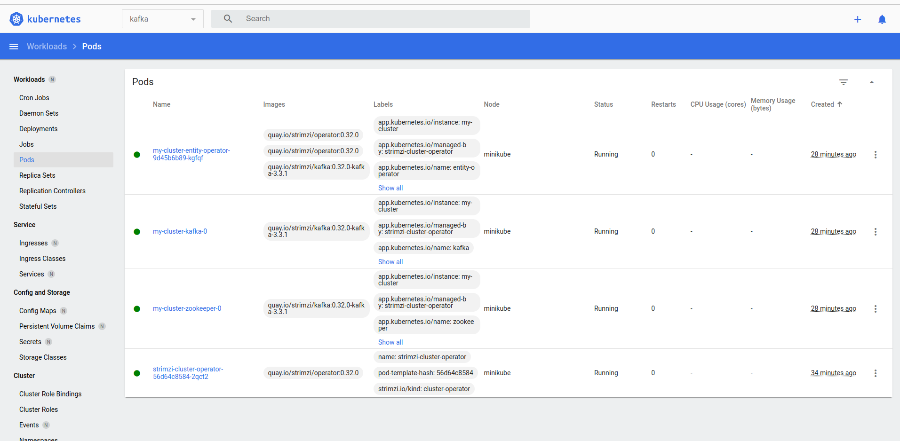
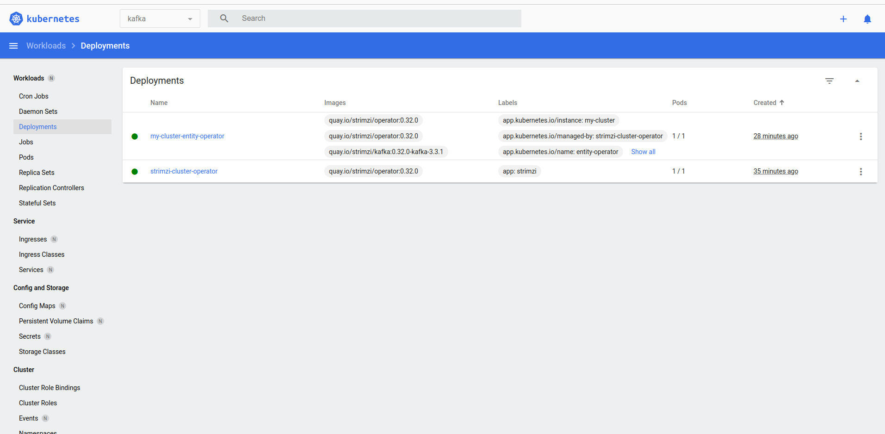
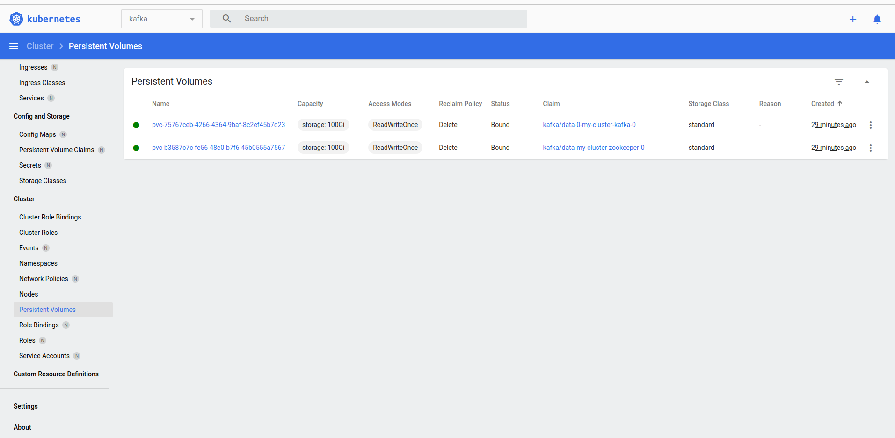

# Kubernetes Kafka
This document outlines how to provision a small Kafka cluster of three brokers/nodes and three Zookeeper instances.

**Table of Contents**

1. [Introduction](#introduction)
2. [Setup](#logic)
3. [Testing](#testing)
4. [Next steps](#next-steps)

## Introduction <a name="introduction"></a>

This is a simple demo to show how using the Srimzi operator allows one to quickly set up a single node Kafka and Zookeeper cluster on Kubernetes (minikube in this case).

## Setup <a name="logic"></a>

For this demo, I used an AWS Ubuntu t2.large to handle minikubes' memory needs without issue. You will also need to make sure the security group you are using not only allows incoming connections from your local machine to ssh via port 22, but HTTP traffic must be allowed so you can view the dashboard. After that you will want to copy the two yaml files and the installation script to the machine:

```
scp -i <your-key-file.pem> singleCluster.yaml ubuntu@<your-public-dns>:
scp -i <your-key-file.pem> strimzi.yaml ubuntu@<your-public-dns>:
scp -i <your-key-file.pem> installation.sh ubuntu@<your-public-dns>:
ssh -i <your-key-file.pem> <your-public-dns>
```
Then make sure the installation.sh is executable by `sudo chmod +x installation.sh`.

You can now run `sudo chmod +x installation.sh` which will:

- Install docker
- Install minikube
- Install kubectl
- Create the kafka namespace
- Create the custom resource definitions used by the Strimzi operator
- Create a single zookeeper and kafka node

## Testing<a name="testing"></a>

To try it out, you will first want to see how things are looking in the namespace via the Kubernetes dashboard. Since this is a remote instance, you will first want to open a few new terminals: one to start a port forward and another to have the dashboard running. Bear in mind we'll be opening another two shortly so it may feel crowded. 

To port forward to your local browser:

`minikube kubectl -- proxy --address='0.0.0.0' --disable-filter=true`

And in another terminal type `minikube dashboard --url`. You should now be able to open `127.0.0.1:8001/api/v1/namespaces/kubernetes-dashboard/services/http:kubernetes-dashboard:/proxy/` in  your browser. You should see able to see all the images I have below:

### Pods


### Deployments


### PVCs


If everything is rosy in the garden, you can now open two terminals to produce and consume messages to a topic, which if not present, will be created. 
```
kubectl -n kafka run kafka-producer -ti --image=quay.io/strimzi/kafka:0.32.0-kafka-3.3.1 --rm=true --restart=Never -- bin/kafka-console-producer.sh --bootstrap-server my-cluster-kafka-bootstrap:9092 --topic my-topic
kubectl -n kafka run kafka-consumer -ti --image=quay.io/strimzi/kafka:0.32.0-kafka-3.3.1 --rm=true --restart=Never -- bin/kafka-console-consumer.sh --bootstrap-server my-cluster-kafka-bootstrap:9092 --topic my-topic --from-beginning
```

## Next steps<a name="next-steps"></a>

One way to extend this model is to now leverage Kafka Connect API with Debezium. This will allow one to connect directly to a database (mysql, postgres etc) for structured persistence of the Kafka messages. More information here: https://debezium.io/documentation/reference/stable/operations/kubernetes.html